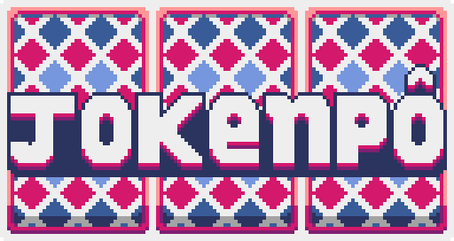

### Sobre o projeto
🚧⚠️Em desenvolvimento...⚠️🚧
*Jokenpô Web* é um projeto baseado no meu game *Jokenpô* feito em Python, agora adaptado para a web. Nesta versão, você pode jogar uma partida de cartas em pixel art contra um bot diretamente no navegador.

Para mais informações, acesse o repositório do projeto original [Jokenpô Python](https://github.com/abelarduu/Jokenpo).

Desenvolvido em HTML, CSS e JavaScript, *Jokenpô Web* oferece uma maneira divertida de jogar.

### Resultado

